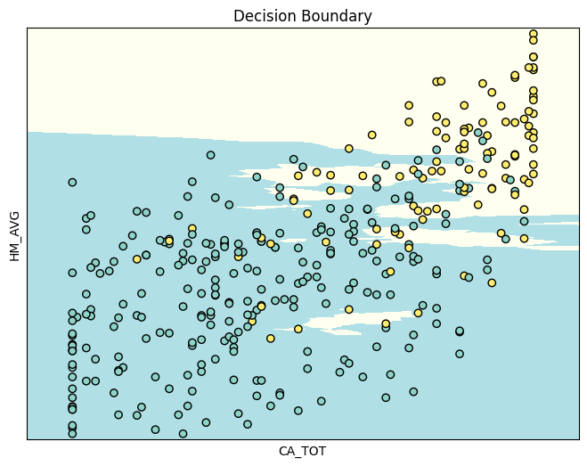

# weather-knn-analysis
기상청 데이터 활용 KNN 분류 분석 - 전운량·습도·강수량 기반 날씨 예측

## 🌤️ 기상청 데이터 KNN 분류 분석
학습 프로젝트 | 기상청 자료 참고 | 2026.05

기상청 종관기상관측장비(ASOS) 데이터를 활용해
전운량·습도·강수량으로 날씨를 분류하는 KNN 모델을 구현한 프로젝트입니다.

> 기상청 제공 학습 자료를 참고하여 직접 구현하였습니다.

## 🔍 핵심 내용

- 전운량(CA_TOT)·습도(HM_AVG)·강수량(RN_DAY) 3개 변수로 날씨 분류
- 결측치(-9) 논리적 대체 처리
- KNN 모델 구현 및 classification_report로 성능 평가
- 최적 K값 탐색

## 🛠️ 사용 기술

| 구분 | 내용 |
|------|------|
| 언어 | Python |
| 라이브러리 | pandas, numpy, sklearn, matplotlib |
| 모델 | KNN (K-Nearest Neighbors) |
| 데이터 | 기상청 종관기상관측장비(ASOS) 2015~2023 |

## 📊 분석 흐름

1. **데이터 로드** — 기상청 ASOS 데이터 불러오기
2. **결측치 처리** — -9값 논리적 대체
3. **변수 선택** — 전운량·습도·강수량 3개 변수
4. **KNN 모델 구현** — 최적 K값 탐색 및 학습
5. **성능 평가** — classification_report 출력

## 🔧 구현 중 수정 사항

| 오류 | 수정 |
|------|------|
| `import sklearn import neighbors` | `from sklearn import neighbors` |
| `y = data['RN_DAY']` | `y = mydata['RN_DAY']` |

## 📐 모델 구조

- **독립변수(X)** — 전운량(CA_TOT), 습도(HM_AVG)
- **종속변수(Y)** — 강수량(RN_DAY) 실제 정답 레이블
- **예측값(Z)** — KNN 모델 예측값
- **거리 계산** — 유클리드 거리, K = 5
- **평가** — 실제값(Y)과 예측값(Z) 비교로 정확도 측정

## 📈 결과

전운량(CA_TOT)이 높아질수록 강수 여부가 달라지는 경계가 형성됨을 확인.
X축: 전운량 / Y축: 습도 / 색상: 강수 여부

## 📁 파일 구성

    weather_knn_analysis.ipynb    ← KNN 분석 코드
    weather_data.xls              ← 기상청 원본 데이터
    Python05                      ← 참고 자료
    README.md

## 📎 참고 자료

- 기상청 종관기상관측 데이터: https://data.kma.go.kr
- 해석 티스토리 : https://sand-and-sun.tistory.com/
